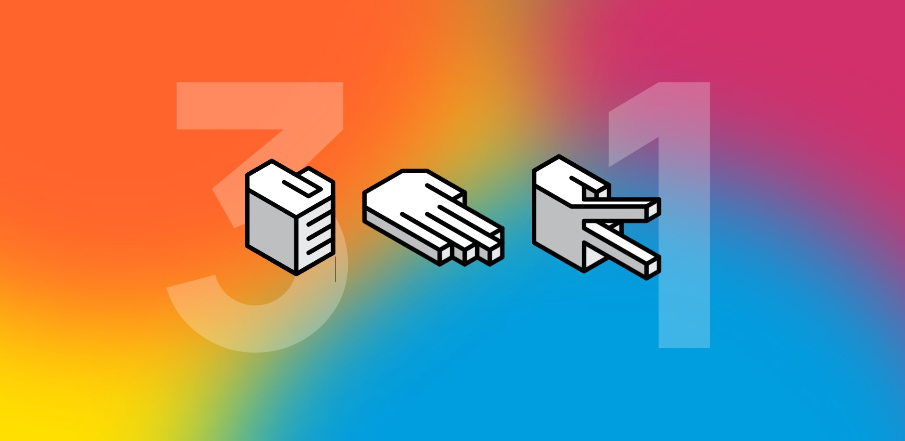
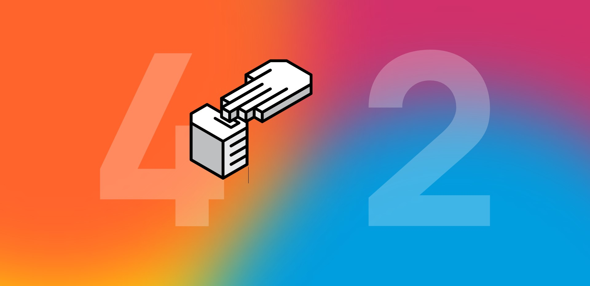
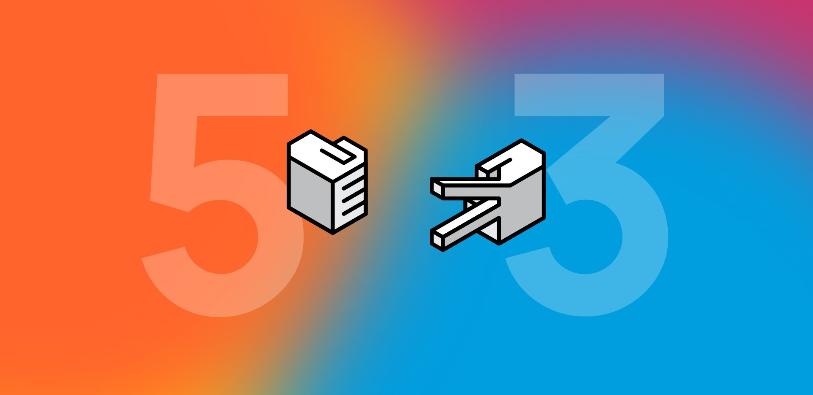

# Rock Paper Scissors 🤘📃✂
A project created to learn the basics of _React_.
The game rock, paper, scissors is a simple which allowed me to explore all that React has to offer while applying it in
a fun and easy way. This also allowed me to apply creative ideas in the mix.

## https://mdv-rock-paper-scissors.netlify.app/

## Build Status

## Screenshots

## Tech Used
**Built with**
  - React
  - Sass

**Dynamic Background**
  - https://github.com/MtheDV/dynamic-js-background

**Font**
  - https://fonts.google.com/specimen/Manrope?query=manrop
  - https://manropefont.com/

## License
MIT 2021 Mathew de Vin